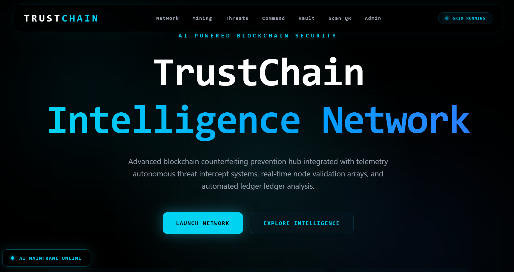
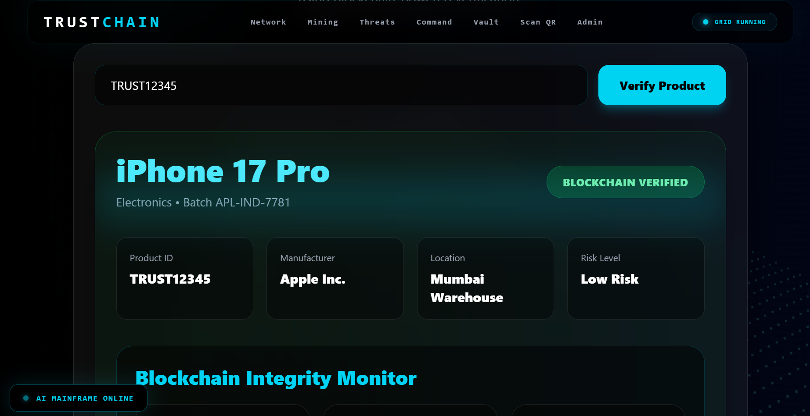
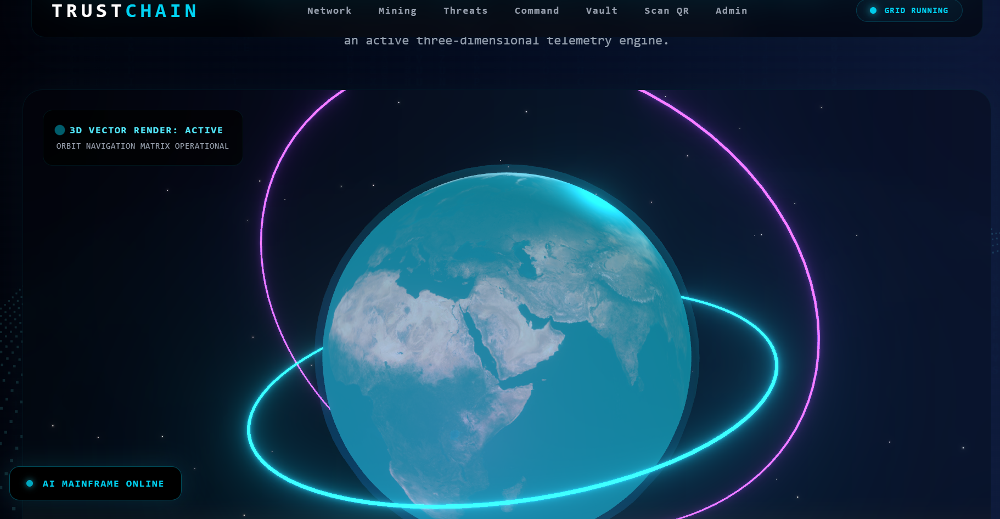
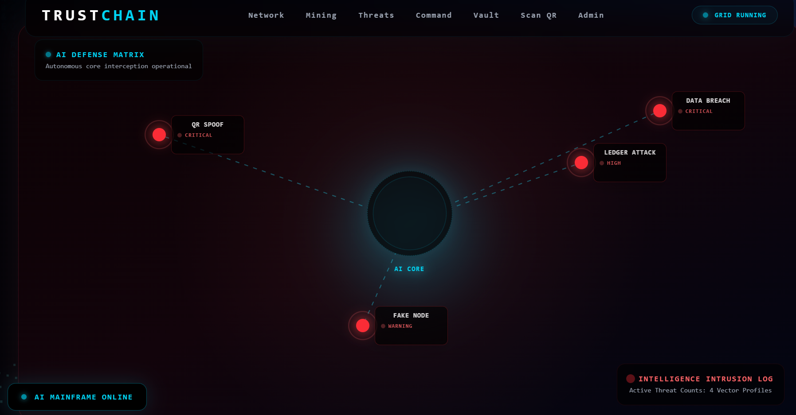
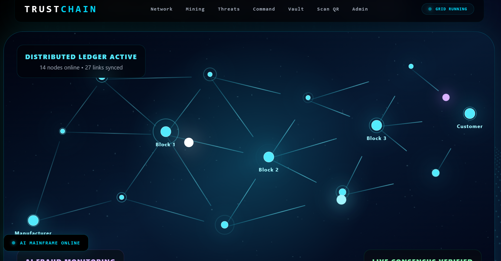
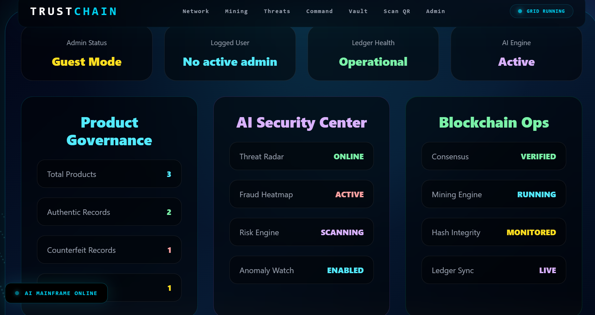

# TrustChain

## Futuristic Blockchain-Based Product Authentication Platform

TrustChain is an advanced full-stack product authentication platform designed to combat counterfeit products using blockchain-inspired verification, intelligent risk analysis, holographic supply-chain visualization, and immersive cybersecurity-inspired UI/UX.

The project combines modern frontend engineering, backend architecture, real-time product verification workflows, and futuristic visual intelligence systems into a single interactive experience.

---

# Live Deployment

## Frontend

https://trustchain-z.vercel.app

## Backend API

https://trustchain-backend-9mrf.onrender.com

---

# Core Features

## Product Verification Engine

* Blockchain-inspired verification workflow
* Product authenticity validation
* Cryptographic integrity simulation
* Real-time verification processing

## Intelligent Risk Detection

* Counterfeit probability analysis
* Dynamic product trust scoring
* Fraud risk assessment system

## Holographic Supply Chain Timeline

* Interactive checkpoint visualization
* Real-time supply trail tracking
* Animated ledger verification flow

## AI Voice Assistant

* Voice-based verification responses
* System intelligence announcements
* Interactive security feedback

## Cybersecurity Interface

* Futuristic AI command terminal
* Neural system visualizations
* Animated blockchain environment
* Real-time dashboard simulations

## QR Product Scanning

* QR-based verification system
* Instant product authentication
* Scanner-based validation workflow

## Full Stack Cloud Deployment

* Frontend hosted on Vercel
* Backend hosted on Render
* GitHub integrated deployment pipeline

---

# Technology Stack

## Frontend

* React.js
* Vite
* Tailwind CSS
* Framer Motion
* Three.js
* GSAP
* Recharts

## Backend

* Node.js
* Express.js
* MongoDB
* JWT Authentication
* Socket.io

## Deployment

* Vercel
* Render
* GitHub

---

# System Architecture

text
Frontend (React + Vite)
        ↓
REST API (Express.js)
        ↓
MongoDB Database
        ↓
Blockchain Verification Engine
        ↓
Risk Analysis System


---

# Installation Guide

## Clone Repository

bash
git clone https://github.com/Alexy-ak06/TrustChain.git


---

## Frontend Setup

bash
cd Client
npm install
npm run dev


---

## Backend Setup

bash
cd server
npm install
npm start


---

# Environment Variables

Create a `.env` file inside the `server` folder.

```env
MONGO_URI=your_mongodb_connection_string
JWT_SECRET=my_secret_key
PORT=5000
```

---

# Screenshots

## Landing Page



---

## Product Verification



---

## Holographic Globe



---

## AI Command Core


---

## Threat Intelligence



---

## Neural Analysis Network


---

## Distributed Blockchain Network



---

## Admin Dashboard



---

# Future Enhancements

* Real blockchain integration
* Enterprise verification APIs
* Multi-device authentication
* Advanced analytics dashboard
* Global product intelligence network

---

# Project Highlights

* Full-stack MERN architecture
* Futuristic cyberpunk UI design
* Blockchain-inspired verification system
* Interactive 3D visualizations
* Real-time voice interaction
* Advanced animation ecosystem
* Cloud deployment pipeline

---

# Author

## Ayush Kumar Mahapatra

GitHub:
https://github.com/Alexy-ak06

---

# License

This project is intended for educational, portfolio, and demonstration purposes.
